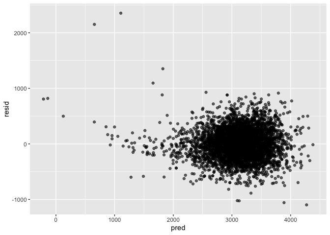

Homework 6
================
Mengyu Zhang
11/16/2019

# Problem 1

### Clean Data

``` r
# import data
birthweight = read_csv("data/birthweight.csv") %>% 
  janitor::clean_names()
```

    ## Parsed with column specification:
    ## cols(
    ##   .default = col_double()
    ## )

    ## See spec(...) for full column specifications.

``` r
# taking a quick look
glimpse(birthweight)
```

    ## Observations: 4,342
    ## Variables: 20
    ## $ babysex  <dbl> 2, 1, 2, 1, 2, 1, 2, 2, 1, 1, 2, 1, 2, 1, 1, 2, 1, 2, 2…
    ## $ bhead    <dbl> 34, 34, 36, 34, 34, 33, 33, 33, 36, 33, 35, 35, 35, 36,…
    ## $ blength  <dbl> 51, 48, 50, 52, 52, 52, 46, 49, 52, 50, 51, 51, 48, 53,…
    ## $ bwt      <dbl> 3629, 3062, 3345, 3062, 3374, 3374, 2523, 2778, 3515, 3…
    ## $ delwt    <dbl> 177, 156, 148, 157, 156, 129, 126, 140, 146, 169, 130, …
    ## $ fincome  <dbl> 35, 65, 85, 55, 5, 55, 96, 5, 85, 75, 55, 55, 75, 75, 6…
    ## $ frace    <dbl> 1, 2, 1, 1, 1, 1, 2, 1, 1, 2, 1, 1, 1, 1, 1, 2, 1, 1, 1…
    ## $ gaweeks  <dbl> 39.9, 25.9, 39.9, 40.0, 41.6, 40.7, 40.3, 37.4, 40.3, 4…
    ## $ malform  <dbl> 0, 0, 0, 0, 0, 0, 0, 0, 0, 0, 0, 0, 0, 0, 0, 0, 0, 0, 0…
    ## $ menarche <dbl> 13, 14, 12, 14, 13, 12, 14, 12, 11, 12, 13, 12, 13, 11,…
    ## $ mheight  <dbl> 63, 65, 64, 64, 66, 66, 72, 62, 61, 64, 67, 62, 64, 68,…
    ## $ momage   <dbl> 36, 25, 29, 18, 20, 23, 29, 19, 13, 19, 23, 16, 28, 23,…
    ## $ mrace    <dbl> 1, 2, 1, 1, 1, 1, 2, 1, 1, 2, 1, 1, 1, 1, 1, 2, 1, 1, 1…
    ## $ parity   <dbl> 3, 0, 0, 0, 0, 0, 0, 0, 0, 0, 0, 0, 0, 0, 0, 0, 0, 0, 0…
    ## $ pnumlbw  <dbl> 0, 0, 0, 0, 0, 0, 0, 0, 0, 0, 0, 0, 0, 0, 0, 0, 0, 0, 0…
    ## $ pnumsga  <dbl> 0, 0, 0, 0, 0, 0, 0, 0, 0, 0, 0, 0, 0, 0, 0, 0, 0, 0, 0…
    ## $ ppbmi    <dbl> 26.27184, 21.34485, 23.56517, 21.84508, 21.02642, 18.60…
    ## $ ppwt     <dbl> 148, 128, 137, 127, 130, 115, 105, 119, 105, 145, 110, …
    ## $ smoken   <dbl> 0.000, 0.000, 1.000, 10.000, 1.000, 0.000, 0.000, 0.000…
    ## $ wtgain   <dbl> 29, 28, 11, 30, 26, 14, 21, 21, 41, 24, 20, 31, 23, 21,…

``` r
birthweight = birthweight %>% 
  mutate(
    babysex = factor(babysex, levels = c(1, 2), labels = c("male", "female")),
    frace = factor(frace, levels = c(1, 2, 3, 4, 8, 9), labels = c("White", "Black", "Asian", "Puerto Rican", "Other", "Unknown")),
    malform = factor(malform, levels = c(0, 1), labels = c("absent", "present")),
    mrace = factor(mrace, levels = c(1, 2, 3, 4, 8, 9), labels = c("White", "Black", "Asian", "Puerto Rican", "Other", "Unknown"))
  )
# check for missing data
sum(is.na(birthweight))
```

    ## [1] 0

``` r
# Stepwise Regression

fit = lm(bwt ~ babysex + bhead + blength + delwt + fincome + frace + gaweeks + malform + menarche + mheight + momage + mrace + parity + pnumlbw + pnumsga + ppbmi + ppwt + smoken + wtgain, data = birthweight)
step = stepAIC(fit, direction="both")
```

    ## Start:  AIC=48717.83
    ## bwt ~ babysex + bhead + blength + delwt + fincome + frace + gaweeks + 
    ##     malform + menarche + mheight + momage + mrace + parity + 
    ##     pnumlbw + pnumsga + ppbmi + ppwt + smoken + wtgain
    ## 
    ## 
    ## Step:  AIC=48717.83
    ## bwt ~ babysex + bhead + blength + delwt + fincome + frace + gaweeks + 
    ##     malform + menarche + mheight + momage + mrace + parity + 
    ##     pnumlbw + pnumsga + ppbmi + ppwt + smoken
    ## 
    ## 
    ## Step:  AIC=48717.83
    ## bwt ~ babysex + bhead + blength + delwt + fincome + frace + gaweeks + 
    ##     malform + menarche + mheight + momage + mrace + parity + 
    ##     pnumlbw + ppbmi + ppwt + smoken
    ## 
    ## 
    ## Step:  AIC=48717.83
    ## bwt ~ babysex + bhead + blength + delwt + fincome + frace + gaweeks + 
    ##     malform + menarche + mheight + momage + mrace + parity + 
    ##     ppbmi + ppwt + smoken
    ## 
    ##            Df Sum of Sq       RSS   AIC
    ## - frace     4    124365 320848704 48712
    ## - malform   1      1419 320725757 48716
    ## - ppbmi     1      6346 320730684 48716
    ## - momage    1     28661 320752999 48716
    ## - mheight   1     66886 320791224 48717
    ## - menarche  1    111679 320836018 48717
    ## - ppwt      1    131132 320855470 48718
    ## <none>                  320724338 48718
    ## - fincome   1    193454 320917792 48718
    ## - parity    1    413584 321137922 48721
    ## - mrace     3    868321 321592659 48724
    ## - babysex   1    853796 321578134 48727
    ## - gaweeks   1   4611823 325336161 48778
    ## - smoken    1   5076393 325800732 48784
    ## - delwt     1   8008891 328733230 48823
    ## - blength   1 102050296 422774634 49915
    ## - bhead     1 106535716 427260054 49961
    ## 
    ## Step:  AIC=48711.51
    ## bwt ~ babysex + bhead + blength + delwt + fincome + gaweeks + 
    ##     malform + menarche + mheight + momage + mrace + parity + 
    ##     ppbmi + ppwt + smoken
    ## 
    ##            Df Sum of Sq       RSS   AIC
    ## - malform   1      1447 320850151 48710
    ## - ppbmi     1      6975 320855679 48710
    ## - momage    1     28379 320877083 48710
    ## - mheight   1     69502 320918206 48710
    ## - menarche  1    115708 320964411 48711
    ## - ppwt      1    133961 320982665 48711
    ## <none>                  320848704 48712
    ## - fincome   1    194405 321043108 48712
    ## - parity    1    414687 321263390 48715
    ## + frace     4    124365 320724338 48718
    ## - babysex   1    852133 321700837 48721
    ## - gaweeks   1   4625208 325473911 48772
    ## - smoken    1   5036389 325885093 48777
    ## - delwt     1   8013099 328861802 48817
    ## - mrace     3  13540415 334389119 48885
    ## - blength   1 101995688 422844392 49908
    ## - bhead     1 106662962 427511666 49956
    ## 
    ## Step:  AIC=48709.53
    ## bwt ~ babysex + bhead + blength + delwt + fincome + gaweeks + 
    ##     menarche + mheight + momage + mrace + parity + ppbmi + ppwt + 
    ##     smoken
    ## 
    ##            Df Sum of Sq       RSS   AIC
    ## - ppbmi     1      6928 320857079 48708
    ## - momage    1     28660 320878811 48708
    ## - mheight   1     69320 320919470 48708
    ## - menarche  1    116027 320966177 48709
    ## - ppwt      1    133894 320984044 48709
    ## <none>                  320850151 48710
    ## - fincome   1    193784 321043934 48710
    ## + malform   1      1447 320848704 48712
    ## - parity    1    414482 321264633 48713
    ## + frace     4    124393 320725757 48716
    ## - babysex   1    851279 321701430 48719
    ## - gaweeks   1   4624003 325474154 48770
    ## - smoken    1   5035195 325885346 48775
    ## - delwt     1   8029079 328879230 48815
    ## - mrace     3  13553320 334403471 48883
    ## - blength   1 102009225 422859375 49906
    ## - bhead     1 106675331 427525481 49954
    ## 
    ## Step:  AIC=48707.63
    ## bwt ~ babysex + bhead + blength + delwt + fincome + gaweeks + 
    ##     menarche + mheight + momage + mrace + parity + ppwt + smoken
    ## 
    ##            Df Sum of Sq       RSS   AIC
    ## - momage    1     29211 320886290 48706
    ## - menarche  1    117635 320974714 48707
    ## <none>                  320857079 48708
    ## - fincome   1    195199 321052278 48708
    ## + ppbmi     1      6928 320850151 48710
    ## + malform   1      1400 320855679 48710
    ## - parity    1    412984 321270064 48711
    ## + frace     4    125020 320732060 48714
    ## - babysex   1    850020 321707099 48717
    ## - mheight   1   1078673 321935752 48720
    ## - ppwt      1   2934023 323791103 48745
    ## - gaweeks   1   4621504 325478583 48768
    ## - smoken    1   5039368 325896447 48773
    ## - delwt     1   8024939 328882018 48813
    ## - mrace     3  13551444 334408523 48881
    ## - blength   1 102018559 422875638 49904
    ## - bhead     1 106821342 427678421 49953
    ## 
    ## Step:  AIC=48706.02
    ## bwt ~ babysex + bhead + blength + delwt + fincome + gaweeks + 
    ##     menarche + mheight + mrace + parity + ppwt + smoken
    ## 
    ##            Df Sum of Sq       RSS   AIC
    ## - menarche  1    100121 320986412 48705
    ## <none>                  320886290 48706
    ## - fincome   1    240800 321127090 48707
    ## + momage    1     29211 320857079 48708
    ## + ppbmi     1      7479 320878811 48708
    ## + malform   1      1678 320884612 48708
    ## - parity    1    431433 321317724 48710
    ## + frace     4    124743 320761547 48712
    ## - babysex   1    841278 321727568 48715
    ## - mheight   1   1076739 321963029 48719
    ## - ppwt      1   2913653 323799943 48743
    ## - gaweeks   1   4676469 325562760 48767
    ## - smoken    1   5045104 325931394 48772
    ## - delwt     1   8000672 328886962 48811
    ## - mrace     3  14667730 335554021 48894
    ## - blength   1 101990556 422876847 49902
    ## - bhead     1 106864308 427750598 49952
    ## 
    ## Step:  AIC=48705.38
    ## bwt ~ babysex + bhead + blength + delwt + fincome + gaweeks + 
    ##     mheight + mrace + parity + ppwt + smoken
    ## 
    ##            Df Sum of Sq       RSS   AIC
    ## <none>                  320986412 48705
    ## + menarche  1    100121 320886290 48706
    ## - fincome   1    245637 321232048 48707
    ## + momage    1     11698 320974714 48707
    ## + ppbmi     1      8823 320977589 48707
    ## + malform   1      1884 320984528 48707
    ## - parity    1    422770 321409181 48709
    ## + frace     4    128726 320857686 48712
    ## - babysex   1    846134 321832545 48715
    ## - mheight   1   1012240 321998651 48717
    ## - ppwt      1   2907049 323893461 48743
    ## - gaweeks   1   4662501 325648912 48766
    ## - smoken    1   5073849 326060260 48771
    ## - delwt     1   8137459 329123871 48812
    ## - mrace     3  14683609 335670021 48894
    ## - blength   1 102191779 423178191 49903
    ## - bhead     1 106779754 427766166 49950

``` r
step$anova # display results
```

    ## Stepwise Model Path 
    ## Analysis of Deviance Table
    ## 
    ## Initial Model:
    ## bwt ~ babysex + bhead + blength + delwt + fincome + frace + gaweeks + 
    ##     malform + menarche + mheight + momage + mrace + parity + 
    ##     pnumlbw + pnumsga + ppbmi + ppwt + smoken + wtgain
    ## 
    ## Final Model:
    ## bwt ~ babysex + bhead + blength + delwt + fincome + gaweeks + 
    ##     mheight + mrace + parity + ppwt + smoken
    ## 
    ## 
    ##         Step Df   Deviance Resid. Df Resid. Dev      AIC
    ## 1                               4320  320724338 48717.83
    ## 2   - wtgain  0      0.000      4320  320724338 48717.83
    ## 3  - pnumsga  0      0.000      4320  320724338 48717.83
    ## 4  - pnumlbw  0      0.000      4320  320724338 48717.83
    ## 5    - frace  4 124365.432      4324  320848704 48711.51
    ## 6  - malform  1   1447.241      4325  320850151 48709.53
    ## 7    - ppbmi  1   6928.376      4326  320857079 48707.63
    ## 8   - momage  1  29211.120      4327  320886290 48706.02
    ## 9 - menarche  1 100121.331      4328  320986412 48705.38

``` r
my_model = lm(bwt ~ babysex + bhead + blength + delwt + fincome + gaweeks + 
    mheight + mrace + parity + ppwt + smoken, data = birthweight)
# Diagnostics
birthweight %>% 
  modelr::add_residuals(my_model) %>% 
  modelr::add_predictions(my_model) %>% 
  ggplot(aes(x = pred, y = resid)) +
  geom_point(alpha = .6)
```

<!-- -->

### Comparision
